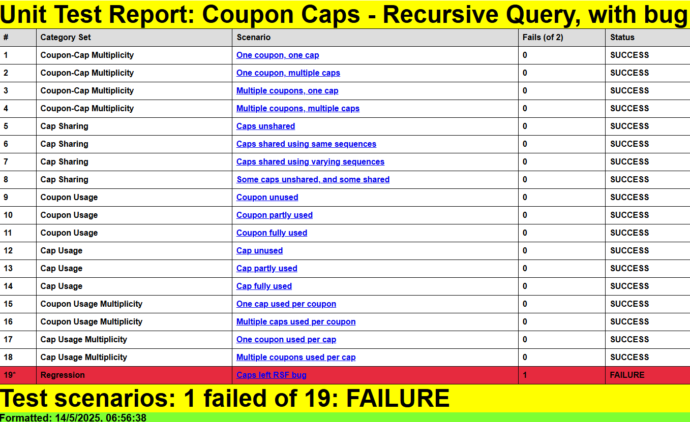
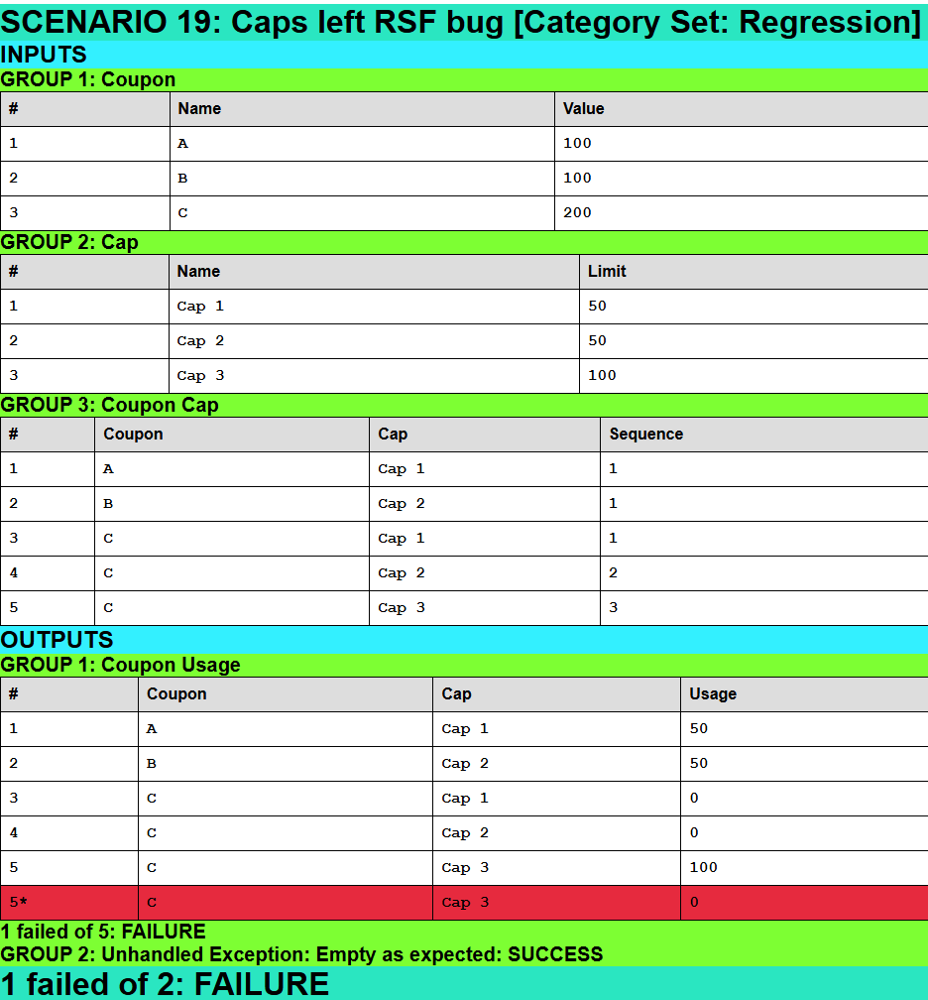
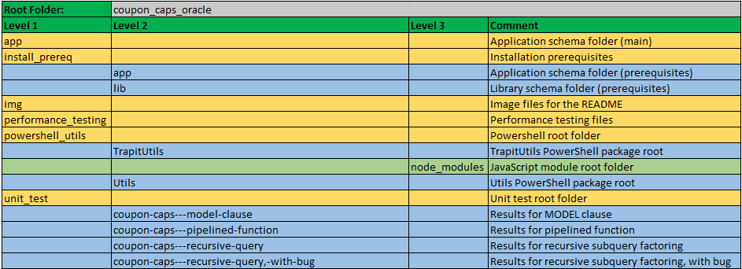

# Coupons, Caps and Functions in Oracle
<br />

This project has the code for blog article [Coupons, Caps, and Functions](https://brenpatf.github.io/2025/06/29/coupons_caps_functions.html).

# In this README...
[&darr; Background](#background)<br />
[&darr; Installation](#installation)<br />
[&darr; Running the Performance Testing](#running-the-performance-testing)<br />
[&darr; Running the Unit Tests](#running-the-unit-tests)<br />
[&darr; Folder Structure](#folder-structure)<br />
[&darr; See Also](#see-also)<br />

## Background
[&uarr; In this README...](#in-this-readme)<br />

On 18 April 2025 a poster asked a question on the AskTom Oracle forum:
[Solving a logical problem using analytical functions](https://asktom.oracle.com/ords/asktom.search?tag=solving-a-logical-problem-using-analytical-functions). The problem turned out to be surprisingly difficult to solve in pure SQL.

I posted two solution methods on the thread for the problem, generalised to an arbitrary number of caps. One solution used Oracle's MODEL clause, the other a pipelined function. In this article, I explain how these work, and add a third method based on recursive subquery factoring. In addition, I analyse the performance characteristics of the three methods using an approach I presented at the 2017 Irish Oracle User Group conference in Dublin, [Dimensional Performance Benchmarking of SQL](http://aprogrammerwrites.eu/?p=2012). The analysis includes curve-fitting using Excel graphs and statistical functions.

The methods are tested using [The Math Function Unit Testing Design Pattern](https://brenpatf.github.io/2023/06/05/the-math-function-unit-testing-design-pattern.html), with test results in HTML and text format included.

Everything is automated.

## Installation
[&uarr; In this README...](#in-this-readme)<br />
[&darr; Prerequisite Applications](#prerequisite-applications)<br />
[&darr; Clone Git Repository](#clone-git-repository)<br />
[&darr; Oracle Installs](#oracle-installs)<br />
[&darr; Powershell and JavaScript Packages](#powershell-and-javascript-packages)<br />

### Prerequisite Applications
[&uarr; Installation](#installation)<br />
[&darr; Github Desktop](#github-desktop)<br />
[&darr; Oracle](#oracle)<br />
[&darr; Node.js](#nodejs)<br />
[&darr; Powershell](#powershell)<br />

#### Github Desktop
[&uarr; Prerequisite Applications](#prerequisite-applications)<br />
In order to clone the code as a git repository you need to have the git application installed. I recommend [Github Desktop](https://desktop.github.com/) UI for managing repositories on windows. This depends on the git application, available here: [git downloads](https://git-scm.com/downloads), but can also be installed from within Github Desktop, according to these instructions:
[How to install GitHub Desktop](https://www.techrepublic.com/article/how-to-install-github-desktop/).

#### Oracle
[&uarr; Prerequisite Applications](#prerequisite-applications)<br />

An Oracle client is required, including sqlplus, with access to an Oracle database:

- [Oracle Instant Client Downloads for Microsoft Windows (x64) 64-bit](https://www.oracle.com/ie/database/technologies/instant-client/winx64-64-downloads.html)

You can download the Oracle database here:

[Oracle Database Software Downloads](https://www.oracle.com/database/technologies/oracle-database-software-downloads.html).

#### Node.js
[&uarr; Prerequisite Applications](#prerequisite-applications)<br />

The unit test results are formatted using a JavaScript program, which is included as part of the current project. Running the program requires the Node.js application:

- [Node.js Downloads](https://nodejs.org/en/download)

#### Powershell
[&uarr; Prerequisite Applications](#prerequisite-applications)<br />

Powershell is optional, and is used in the project for automation purposes, and for generating a template for the JSON input file required by [The Math Function Unit Testing Design Pattern](https://brenpatf.github.io/2023/06/05/the-math-function-unit-testing-design-pattern.html):

- [Installing Windows PowerShell](https://learn.microsoft.com/en-us/powershell/scripting/windows-powershell/install/installing-windows-powershell)

### Clone Git Repository
[&uarr; Installation](#installation)<br />

The following steps will download the repository into a folder, item_category_optimization_oracle, within your GitHub root folder:
- Open Github desktop and click [File/Clone repository...]
- Paste into the url field on the URL tab: https://github.com/BrenPatF/coupon_caps_oracle.git
- Choose local path as folder where you want your GitHub root to be
- Click [Clone]

### Oracle Installs
[&uarr; Installation](#installation)<br />

The Oracle installation can be performed via a single PowerShell script, or in a series of smaller steps (with the script names contained in the PowerShell script).

#### Automated Installation

The Oracle installation can be performed simply by running the following powershell script, `Install-Coupon_Caps.ps1`:

##### [Folder: (module root)]

```powershell
.\Install-Coupon_Caps
```

Some points to note:
- This script copies a unit test JSON file to a folder "c:/input", creating it if it does not exist, and aborting if it exists as a file
- This script tries to create lib and app schemas using sys schema, with all passwords assumed to be the usernames, and TNS alias orclpdb
- The script runs the sqplus script drop_utils_users.sql first to drop those schemas if they exist

### Powershell and JavaScript Packages
[&uarr; Installation](#installation)<br />

As noted in the Prerequisite Applications section, JavaScript is used to format unit test results, and Powershell is optionally used for automation purposes, and for generating a template for the JSON input file required by [The Math Function Unit Testing Design Pattern](https://brenpatf.github.io/2023/06/05/the-math-function-unit-testing-design-pattern.html).

Both JavaScript and Powershell packages have their own GitHub projects:

- [Trapit - JavaScript Unit Tester/Formatter](https://github.com/BrenPatF/trapit_nodejs_tester)
- [Powershell Utilities Module](https://github.com/BrenPatF/powershell_utils)

However, for convenience the packages are included in the current project folder structure, rooted in the powershell_utils subfolder, and do not require separate installation.

There are two main entry points in the Powershell module, listed below:

- Format-JSON-Coupon_Caps.ps1<br />

This is used to generate a template input JSON file for unit testing.

- Test-Format-Coupon_Caps.ps1<br />

This runs Oracle unit tests for a given test group ('coupon_caps' here), and includes the formatting step by means of a call to the JavaScript formatter. Further details are included in [Running the Unit Tests](#running-the-unit-tests) below.

## Running the Performance Testing
[&uarr; In this README...](#in-this-readme)<br />
[&darr; Oracle Script to Run Views on a Data Point](#oracle-script-to-run-views-on-a-data-point)<br />
[&darr; Oracle Procedure Run_Data_Point](#oracle-procedure-run_data_point)<br />
[&darr; Performance Testing PowerShell Script](#performance-testing-powershell-script)<br />

#### [Schema: app; Folder: performance_testing; Script: Run-All.ps1]

The running of the queries on all datasets is completely automated, using a PowerShell script, Run-All.ps1, that calls a sqlplus script, run_dp.sql, at each data point.

#### Oracle Script to Run Views on a Data Point
[&uarr; Running the Performance Testing](#running-the-performance-testing)<br />

This sqlplus script is passed dataset parameters from the driving PowerShell script, and calls the Run_Data_Point procedure to run and time the views, using the TIMER_SET bind variable.

##### run_dp.sql
```sql
DEFINE N_COU = &1
DEFINE N_CAP_PER_COU = &2
DEFINE N_CAP = &3
DEFINE N_VIEWS = &4
DEFINE XPLAN_YN = '&5'
PROMPT Create data - &N_COU coupons, &N_CAP_PER_COU caps per coupon, &N_CAP caps
TRUNCATE TABLE coupon_cap_mapping
/
TRUNCATE TABLE cap_data
/
TRUNCATE TABLE coupon_data
/
DECLARE
  l_n_cou               PLS_INTEGER := &N_COU;
  l_n_cap_per_cou       PLS_INTEGER := &N_CAP_PER_COU;
  l_n_cap               PLS_INTEGER := &N_CAP;
  l_n_views             PLS_INTEGER := &N_VIEWS;
  l_get_xplan           BOOLEAN := '&XPLAN_YN' = 'Y';
BEGIN
  Coupon_Caps.Run_Data_Point(
            p_n_cou           => l_n_cou,
            p_n_cap_per_cou   => l_n_cap_per_cou,
            p_n_cap           => l_n_cap,
            p_n_views         => l_n_views,
            p_ts              => :TIMER_SET,
            p_get_xplan       => l_get_xplan);
END;
/
```

#### Oracle Procedure Run_Data_Point
[&uarr; Running the Performance Testing](#running-the-performance-testing)<br />

The following procedure first calls Create_Test_Data to set up the dataset at a given point, then runs and times each view (excluding RSF if p_n_views = 2), with conditional logic around detail of timing, and whether to get an execution plan.

##### Coupon_Caps.Run_Data_Point
```sql
PROCEDURE Run_Data_Point(
            p_n_cou                        PLS_INTEGER,
            p_n_cap_per_cou                PLS_INTEGER,
            p_n_cap                        PLS_INTEGER,
            p_n_views                      PLS_INTEGER,
            p_ts                           PLS_INTEGER,
            p_get_xplan                    BOOLEAN := FALSE) IS
  l_view_lis            L1_chr_arr := L1_chr_arr('coupon_caps_plf_agg_v', 'coupon_caps_mod_agg_v', 'coupon_caps_rsf_agg_v');
  l_dp_name             VARCHAR2(100) := p_n_cou || ' - ' || p_n_cap_per_cou || ' - ' || p_n_cap;

  PROCEDURE do_Run (
            p_view_name                    VARCHAR2,
            p_get_xplan                    BOOLEAN,
            p_timer_detail                 BOOLEAN) IS
    l_act_lis             L1_chr_arr;
    l_timer_name          VARCHAR2(100) := 'Sum-' || p_view_name;
    l_timer_name_det      VARCHAR2(100) := p_view_name || ' ' || l_dp_name;
    l_search              VARCHAR2(100) := p_view_name || TRUNC(DBMS_RANDOM.VALUE(100000, 999999));
  BEGIN
    IF p_get_xplan THEN
      l_timer_name := 'XPLAN-' || l_timer_name;
      l_timer_name_det := 'XPLAN-' || l_timer_name_det;
    END IF;
    IF p_timer_detail THEN
      l_timer_name := l_timer_name_det;
    END IF;
    l_act_lis := Utils.View_To_List(
                                p_view_name     => p_view_name,
                                p_sel_value_lis => L1_chr_arr('n_pos_usages', 'n_rows', 'sum_usage'),
                                p_hint          => CASE WHEN p_get_xplan THEN 'gather_plan_statistics ' || l_search END);
    Timer_Set.Increment_Time(p_ts, l_timer_name);
    IF p_get_xplan THEN
      Utils.L(Utils.Get_XPlan(p_sql_marker => l_search));
    END IF;
    Utils.L('Result for ' || l_timer_name_det || ': ' || l_act_lis(1));
  END do_Run;

BEGIN
  Create_Test_Data(
            p_n_cou           => p_n_cou,
            p_n_cap           => p_n_cap,
            p_n_cap_per_cou   => p_n_cap_per_cou);
  Timer_Set.Increment_Time(p_ts, 'create_Test_Data: ' || l_dp_name);
  FOR i IN 1..p_n_views LOOP
    do_Run(p_view_name    => l_view_lis(i),
           p_get_xplan    => FALSE,
           p_timer_detail => CASE WHEN p_n_views = 3 AND i < 3 THEN FALSE ELSE TRUE END);
    IF p_get_xplan AND (p_n_views = 2 OR i = 3) THEN
      do_Run(p_view_name    => l_view_lis(i),
             p_get_xplan    => TRUE,
             p_timer_detail => TRUE);
    END IF;
  END LOOP;
END Run_Data_Point;
END Coupon_Caps;
```

#### Performance Testing PowerShell Script
[&uarr; Running the Performance Testing](#running-the-performance-testing)<br />

This is the PowerShell driving script for performance testing. It adds an index suffix to two results files:

- results_XX.log: This is the full results log including execution plans all the timings
- results_XX.csv: This is an extract of the relevant timings for development of graphs and tables in Excel

It calls run_dp.sql repeatedly within a single sqlplus session to run the views for each data point, after creating a new timer set with index stored in a bind variable, and writes out the timings at the end. Logging is via autonomous transactions to the table LOG_LINES.

##### Run-All.ps1
```powershell
Date -format "dd-MMM-yy HH:mm:ss"
$startTime = Get-Date
[int]$maxIndex = Get-ChildItem -Path . -Filter "results_??.log" |
    ForEach-Object {
        if ($_ -match 'results_(\d{2})\.log') {
            [int]$matches[1]
        }
    } |
    Measure-Object -Maximum |
    Select-Object -ExpandProperty Maximum
$logs = Get-ChildItem | Where-Object { $_.Name -match "^results_\d+.log$" }
$nxtIndex = ($maxIndex + 1).ToString("D2")
$newLog = ('results_' + $nxtIndex)

$inputs = [ordered]@{
    mod_plf     = @(
        @(10000, 12, 22), @(20000, 12, 22), @(30000, 12, 22), @(40000, 12, 22), @(50000, 12, 22), @(60000, 12, 22, 'Y'),
        @(60000, 2, 22),  @(60000, 4, 22),  @(60000, 6, 22),  @(60000, 8, 22),  @(60000, 10, 22),
        @(60000, 12, 12), @(60000, 12, 14), @(60000, 12, 16), @(60000, 12, 18), @(60000, 12, 20)
    )
    mod_plf_rsf = @(
        @(1000, 12, 22),  @(2000, 12, 22),  @(3000, 12, 22),  @(4000, 12, 22),  @(5000, 12, 22),  @(6000, 12, 22, 'Y'),
        @(6000, 2, 22),   @(6000, 4, 22),   @(6000, 6, 22),   @(6000, 8, 22),   @(6000, 10, 22),
        @(6000, 12, 12),  @(6000, 12, 14),  @(6000, 12, 16),  @(6000, 12, 18),  @(6000, 12, 20)
    )
}
$cmdLis = @(
    "@..\install_prereq\initspool $newLog",
    "VAR TIMER_SET NUMBER",
    "DELETE log_lines;"
    "EXEC :TIMER_SET := Timer_Set.Construct('Run_All');"
)
$n_views = 2
foreach($i in $inputs.Keys){
    $i
    foreach($p in $inputs[$i]) {
        $xplan = 'N'
        if($p[3]) {
            $xplan = 'Y'
        }
        $cmdLis += '@run_dp ' + $p[0] + ' ' + $p[1] + ' ' + $p[2] + ' ' + $n_views + ' ' +  $xplan
    }
    $n_views = 3
}
$cmdLis += 'EXEC Utils.L(Timer_Set.Format_Results(:TIMER_SET));'
$cmdLis += 'SET HEAD OFF'
$cmdLis += 'SELECT line FROM log_lines ORDER BY id;'
$cmdLis += '@..\install_prereq\endspool'
$cmdLis += 'exit'
[string]$cmdStr = $cmdLis -join [Environment]::NewLine
$cmdStr
$eat = $cmdStr | sqlplus 'app/app@orclpdb'
.\Get-Csv $nxtIndex
Get-Content ($newLog + '.log') | Select-String 'Result for'
$elapsedTime = (Get-Date) - $startTime
$roundedTime = [math]::Round($elapsedTime.TotalSeconds)
"Total time taken: $roundedTime seconds"
```

Here is an example of the summary log file:

<div style="overflow-y: auto; max-height: 500px">

```
27-Jun-25 00:07:49
mod_plf
mod_plf_rsf
@..\install_prereq\initspool results_05
VAR TIMER_SET NUMBER
DELETE log_lines;
EXEC :TIMER_SET := Timer_Set.Construct('Run_All');
@run_dp 10000 12 22 2 N
@run_dp 20000 12 22 2 N
@run_dp 30000 12 22 2 N
@run_dp 40000 12 22 2 N
@run_dp 50000 12 22 2 N
@run_dp 60000 12 22 2 Y
@run_dp 60000 2 22 2 N
@run_dp 60000 4 22 2 N
@run_dp 60000 6 22 2 N
@run_dp 60000 8 22 2 N
@run_dp 60000 10 22 2 N
@run_dp 60000 12 12 2 N
@run_dp 60000 12 14 2 N
@run_dp 60000 12 16 2 N
@run_dp 60000 12 18 2 N
@run_dp 60000 12 20 2 N
@run_dp 1000 12 22 3 N
@run_dp 2000 12 22 3 N
@run_dp 3000 12 22 3 N
@run_dp 4000 12 22 3 N
@run_dp 5000 12 22 3 N
@run_dp 6000 12 22 3 Y
@run_dp 6000 2 22 3 N
@run_dp 6000 4 22 3 N
@run_dp 6000 6 22 3 N
@run_dp 6000 8 22 3 N
@run_dp 6000 10 22 3 N
@run_dp 6000 12 12 3 N
@run_dp 6000 12 14 3 N
@run_dp 6000 12 16 3 N
@run_dp 6000 12 18 3 N
@run_dp 6000 12 20 3 N
EXEC Utils.L(Timer_Set.Format_Results(:TIMER_SET));
SET HEAD OFF
SELECT line FROM log_lines ORDER BY id;
@..\install_prereq\endspool
exit

Result for coupon_caps_plf_agg_v 10000 - 12 - 22: 10003|120000|2005469
Result for coupon_caps_mod_agg_v 10000 - 12 - 22: 10003|120000|2005469
Result for coupon_caps_plf_agg_v 20000 - 12 - 22: 20003|240000|3989731
Result for coupon_caps_mod_agg_v 20000 - 12 - 22: 20003|240000|3989731
Result for coupon_caps_plf_agg_v 30000 - 12 - 22: 30009|360000|6018082
Result for coupon_caps_mod_agg_v 30000 - 12 - 22: 30009|360000|6018082
Result for coupon_caps_plf_agg_v 40000 - 12 - 22: 40014|480000|8009645
Result for coupon_caps_mod_agg_v 40000 - 12 - 22: 40014|480000|8009645
Result for coupon_caps_plf_agg_v 50000 - 12 - 22: 37533|600000|7521132
Result for coupon_caps_mod_agg_v 50000 - 12 - 22: 37533|600000|7521132
Result for coupon_caps_plf_agg_v 60000 - 12 - 22: 40969|720000|8192724
Result for XPLAN-coupon_caps_plf_agg_v 60000 - 12 - 22: 40969|720000|8192724
Result for coupon_caps_mod_agg_v 60000 - 12 - 22: 40969|720000|8192724
Result for XPLAN-coupon_caps_mod_agg_v 60000 - 12 - 22: 40969|720000|8192724
Result for coupon_caps_plf_agg_v 60000 - 2 - 22: 50538|120000|10086847
Result for coupon_caps_mod_agg_v 60000 - 2 - 22: 50538|120000|10086847
Result for coupon_caps_plf_agg_v 60000 - 4 - 22: 34720|240000|6937511
Result for coupon_caps_mod_agg_v 60000 - 4 - 22: 34720|240000|6937511
Result for coupon_caps_plf_agg_v 60000 - 6 - 22: 54601|360000|10913748
Result for coupon_caps_mod_agg_v 60000 - 6 - 22: 54601|360000|10913748
Result for coupon_caps_plf_agg_v 60000 - 8 - 22: 45811|480000|9154255
Result for coupon_caps_mod_agg_v 60000 - 8 - 22: 45811|480000|9154255
Result for coupon_caps_plf_agg_v 60000 - 10 - 22: 38486|600000|7697075
Result for coupon_caps_mod_agg_v 60000 - 10 - 22: 38486|600000|7697075
Result for coupon_caps_plf_agg_v 60000 - 12 - 12: 21782|720000|4358611
Result for coupon_caps_mod_agg_v 60000 - 12 - 12: 21782|720000|4358611
Result for coupon_caps_plf_agg_v 60000 - 12 - 14: 26787|720000|5353755
Result for coupon_caps_mod_agg_v 60000 - 12 - 14: 26787|720000|5353755
Result for coupon_caps_plf_agg_v 60000 - 12 - 16: 30315|720000|6072177
Result for coupon_caps_mod_agg_v 60000 - 12 - 16: 30315|720000|6072177
Result for coupon_caps_plf_agg_v 60000 - 12 - 18: 40836|720000|8163137
Result for coupon_caps_mod_agg_v 60000 - 12 - 18: 40836|720000|8163137
Result for coupon_caps_plf_agg_v 60000 - 12 - 20: 39147|720000|7824067
Result for coupon_caps_mod_agg_v 60000 - 12 - 20: 39147|720000|7824067
Result for coupon_caps_plf_agg_v 1000 - 12 - 22: 1000|12000|199649
Result for coupon_caps_mod_agg_v 1000 - 12 - 22: 1000|12000|199649
Result for coupon_caps_rsf_agg_v 1000 - 12 - 22: 1000|12000|199649
Result for coupon_caps_plf_agg_v 2000 - 12 - 22: 2001|24000|398274
Result for coupon_caps_mod_agg_v 2000 - 12 - 22: 2001|24000|398274
Result for coupon_caps_rsf_agg_v 2000 - 12 - 22: 2001|24000|398274
Result for coupon_caps_plf_agg_v 3000 - 12 - 22: 3000|36000|596315
Result for coupon_caps_mod_agg_v 3000 - 12 - 22: 3000|36000|596315
Result for coupon_caps_rsf_agg_v 3000 - 12 - 22: 3000|36000|596315
Result for coupon_caps_plf_agg_v 4000 - 12 - 22: 4001|48000|803558
Result for coupon_caps_mod_agg_v 4000 - 12 - 22: 4001|48000|803558
Result for coupon_caps_rsf_agg_v 4000 - 12 - 22: 4001|48000|803558
Result for coupon_caps_plf_agg_v 5000 - 12 - 22: 5003|60000|996684
Result for coupon_caps_mod_agg_v 5000 - 12 - 22: 5003|60000|996684
Result for coupon_caps_rsf_agg_v 5000 - 12 - 22: 5003|60000|996684
Result for coupon_caps_plf_agg_v 6000 - 12 - 22: 6001|72000|1201920
Result for coupon_caps_mod_agg_v 6000 - 12 - 22: 6001|72000|1201920
Result for coupon_caps_rsf_agg_v 6000 - 12 - 22: 6001|72000|1201920
Result for XPLAN-coupon_caps_rsf_agg_v 6000 - 12 - 22: 6001|72000|1201920
Result for coupon_caps_plf_agg_v 6000 - 2 - 22: 5960|12000|1192685
Result for coupon_caps_mod_agg_v 6000 - 2 - 22: 5960|12000|1192685
Result for coupon_caps_rsf_agg_v 6000 - 2 - 22: 5960|12000|1192685
Result for coupon_caps_plf_agg_v 6000 - 4 - 22: 6000|24000|1198069
Result for coupon_caps_mod_agg_v 6000 - 4 - 22: 6000|24000|1198069
Result for coupon_caps_rsf_agg_v 6000 - 4 - 22: 6000|24000|1198069
Result for coupon_caps_plf_agg_v 6000 - 6 - 22: 6001|36000|1194225
Result for coupon_caps_mod_agg_v 6000 - 6 - 22: 6001|36000|1194225
Result for coupon_caps_rsf_agg_v 6000 - 6 - 22: 6001|36000|1194225
Result for coupon_caps_plf_agg_v 6000 - 8 - 22: 6002|48000|1203097
Result for coupon_caps_mod_agg_v 6000 - 8 - 22: 6002|48000|1203097
Result for coupon_caps_rsf_agg_v 6000 - 8 - 22: 6002|48000|1203097
Result for coupon_caps_plf_agg_v 6000 - 10 - 22: 6001|60000|1200948
Result for coupon_caps_mod_agg_v 6000 - 10 - 22: 6001|60000|1200948
Result for coupon_caps_rsf_agg_v 6000 - 10 - 22: 6001|60000|1200948
Result for coupon_caps_plf_agg_v 6000 - 12 - 12: 6000|72000|1195606
Result for coupon_caps_mod_agg_v 6000 - 12 - 12: 6000|72000|1195606
Result for coupon_caps_rsf_agg_v 6000 - 12 - 12: 6000|72000|1195606
Result for coupon_caps_plf_agg_v 6000 - 12 - 14: 6001|72000|1206590
Result for coupon_caps_mod_agg_v 6000 - 12 - 14: 6001|72000|1206590
Result for coupon_caps_rsf_agg_v 6000 - 12 - 14: 6001|72000|1206590
Result for coupon_caps_plf_agg_v 6000 - 12 - 16: 6000|72000|1201414
Result for coupon_caps_mod_agg_v 6000 - 12 - 16: 6000|72000|1201414
Result for coupon_caps_rsf_agg_v 6000 - 12 - 16: 6000|72000|1201414
Result for coupon_caps_plf_agg_v 6000 - 12 - 18: 6000|72000|1197831
Result for coupon_caps_mod_agg_v 6000 - 12 - 18: 6000|72000|1197831
Result for coupon_caps_rsf_agg_v 6000 - 12 - 18: 6000|72000|1197831
Result for coupon_caps_plf_agg_v 6000 - 12 - 20: 6003|72000|1202728
Result for coupon_caps_mod_agg_v 6000 - 12 - 20: 6003|72000|1202728
Result for coupon_caps_rsf_agg_v 6000 - 12 - 20: 6003|72000|1202728
Total time taken: 13831 seconds

```
</div>


## Running the Unit Tests
[&uarr; In this README...](#in-this-readme)<br />
[&darr; Unit Test PowerShell Script](#unit-test-powershell-script)<br />
[&darr; Unit Test Results](#unit-test-results)<br />

Unit testing is fully automated, using a driving PowerShell script. See the associated blog article for more details, [Coupons, Caps and Functions - Blog](https://brenpatf.github.io/2025/06/29/coupons_caps_functions.html).

#### [Schema: app; Folder: unit_test; Script: Test-Format-Coupon_Caps.ps1]

### Unit Test PowerShell Script
[&uarr; Running the Unit Tests](#running-the-unit-tests)<br />


##### Test-Format-Coupon_Caps.ps1

```powershell
Import-Module ..\powershell_utils\TrapitUtils\TrapitUtils
Test-FormatDB 'app/app' 'orclpdb' 'coupon_caps ' $PSScriptRoot `
'BEGIN
    Utils.g_w_is_active := FALSE;
END;
/
'
```

This script calls the TrapitUtils library function Test-FormatDB, passing in for the `preSQL` parameter a SQL string to turn off logging to spool file.

`Test-FormatDB` is the function from the TrapitUtils powershell package that calls the main test driver function, then passes the output JSON file name to the JavaScript formatter and outputs a summary of the results. It takes as parameters:

- `unpw`        - Oracle user name / password string
- `conn`        - Oracle connection string (such as the TNS alias)
- `utGroup`     - Oracle unit test group
- `testRoot`    - unit testing root folder, where results subfolders will be placed
- `preSQL`      - SQL to execute first


### Unit Test Results
[&uarr; Running the Unit Tests](#running-the-unit-tests)<br />
[&darr; Unit Test Summary](#unit-test-summary)<br />
[&darr; Unit Test Report: Coupon Caps - Recursive Query, with bug](#unit-test-report-coupon-caps---recursive-query-with-bug)<br />
[&darr; Results for Scenario 19: Caps left RSF bug [Category Set: Regression]](#results-for-scenario-19-caps-left-rsf-bug-category-set-regression)<br />

#### Unit Test Summary
[&uarr; Unit Test Results](#unit-test-results)<br />

The unit test script creates a results subfolder for each unit in the 'coupon_caps' group, with results in text and HTML formats, in the script folder, and outputs the following summary:

<div style="overflow-y: auto; max-height: 500px">

```
File:          tt_coupon_caps.coupon_caps_mod_out.json
Title:         Coupon Caps - Model Clause
Inp Groups:    3
Out Groups:    2
Tests:         19
Fails:         0
Folder:        coupon-caps---model-clause

File:          tt_coupon_caps.coupon_caps_rsf_out.json
Title:         Coupon Caps - Recursive Query
Inp Groups:    3
Out Groups:    2
Tests:         19
Fails:         0
Folder:        coupon-caps---recursive-query

File:          tt_coupon_caps.coupon_caps_rsf_bug_out.json
Title:         Coupon Caps - Recursive Query, with bug
Inp Groups:    3
Out Groups:    2
Tests:         19
Fails:         1
Folder:        coupon-caps---recursive-query,-with-bug

File:          tt_coupon_caps.coupon_caps_plf_out.json
Title:         Coupon Caps - Pipelined Function
Inp Groups:    3
Out Groups:    2
Tests:         19
Fails:         0
Folder:        coupon-caps---pipelined-function
```
</div>

You can review the full HTML formatted unit test results here for the four views tested:

- [Unit Test Report: Coupon Caps - Model Clause](http://htmlpreview.github.io/?https://github.com/BrenPatF/coupon_caps_oracle/blob/master/unit_test/coupon-caps---model-clause/coupon-caps---model-clause.html)
- [Unit Test Report: Coupon Caps - Recursive Query](http://htmlpreview.github.io/?https://github.com/BrenPatF/coupon_caps_oracle/blob/master/unit_test/coupon-caps---recursive-query/coupon-caps---recursive-query.html)
- [Unit Test Report: Coupon Caps - Recursive Query, with bug](http://htmlpreview.github.io/?https://github.com/BrenPatF/coupon_caps_oracle/blob/master/unit_test/coupon-caps---recursive-query,-with-bug/coupon-caps---recursive-query,-with-bug.html)
- [Unit Test Report: Coupon Caps - Pipelined Function](http://htmlpreview.github.io/?https://github.com/BrenPatF/coupon_caps_oracle/blob/master/unit_test/coupon-caps---pipelined-function/coupon-caps---pipelined-function.html)

Next we show the scenario-level summary of results for the view with a bug.

#### Unit Test Report: Coupon Caps - Recursive Query, with bug
[&uarr; Unit Test Results](#unit-test-results)<br />



#### Results for Scenario 19: Caps left RSF bug [Category Set: Regression]
[&uarr; Unit Test Results](#unit-test-results)<br />

Here is the results page for scenario 19 in HTML format for the view with a bug:


## Folder Structure
[&uarr; In this README...](#in-this-readme)<br />

The project folder structure is shown below.



There are five subfolders below the trapit root folder:
- `app`: Application schema folder (main)
- `install_prereq`: Installation prerequisites
- `img`: Image files for the README
- `performance_testing`: Performance testing files
- `powershell_utils`: Powershell packages, with JavaScript Trapit module included in TrapitUtils
- `unit_test`: Unit test root folder

## See Also
[&uarr; In this README...](#in-this-readme)<br />
- [Coupons, Caps and Functions - Blog](https://brenpatf.github.io/2025/06/29/coupons_caps_functions.html)
- [Solving a logical problem using analytical functions](https://asktom.oracle.com/ords/-asktom.search?tag=solving-a-logical-problem-using-analytical-functions)
- [The Math Function Unit Testing Design Pattern](https://brenpatf.github.io/2023/06/05/the-math-function-unit-testing-design-pattern.html)
- [Trapit - JavaScript Unit Tester/Formatter](https://github.com/BrenPatF/trapit_nodejs_tester)
- [Powershell Utilities Module](https://github.com/BrenPatF/powershell_utils)
- [Oracle Instant Client Downloads for Microsoft Windows (x64) 64-bit](https://www.oracle.com/ie/database/technologies/instant-client/winx64-64-downloads.html)
- [Oracle Database Software Downloads](https://www.oracle.com/database/technologies/oracle-database-software-downloads.html).
- [Node.js Downloads](https://nodejs.org/en/download)
- [Installing Windows PowerShell](https://learn.microsoft.com/en-us/powershell/scripting/windows-powershell/install/installing-windows-powershell)

## Software Versions

- Windows 11
- Powershell 7
- npm 10.5.0
- Node.js v20.12.1
- Oracle Database Version 23.4.0.24.05

## License
MIT
